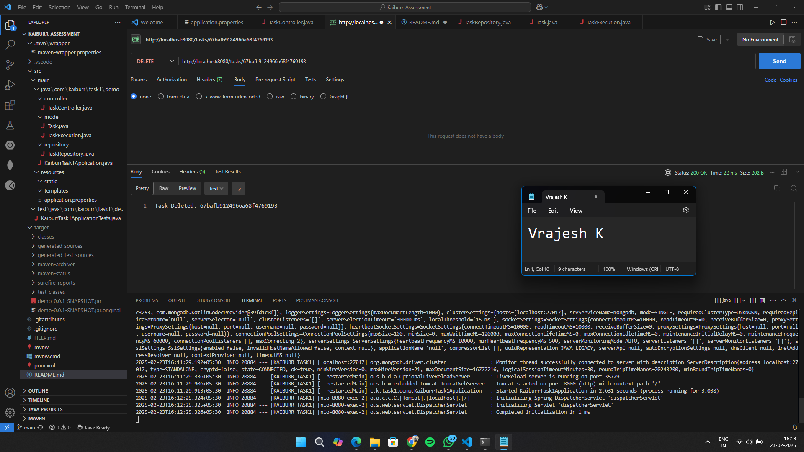

# Kaiburr Task 1 - REST API with Spring Boot and MongoDB

## Project Overview
This project implements a REST API to manage tasks and execute shell commands. The tasks are stored in MongoDB, and the application provides endpoints to create, retrieve, update, delete, search, and execute tasks.

## API Endpoints
GET /tasks - Retrieve all tasks  
GET /tasks/{id} - Retrieve task by ID  
POST /tasks - Add a new task  
PUT /tasks/{id} - Update a task  
DELETE /tasks/{id} - Delete a task  
GET /tasks/search?name=xyz - Search tasks by name  
PUT /tasks/{id}/execute - Execute a shell command  

## How to Run the Project

### 1. Start MongoDB
Make sure MongoDB is installed and running before starting the application.  

Open a new terminal and run:  
```
mongod
```
Open another new terminal and connect to MongoDB:  
```
mongosh
```
Check if MongoDB is running correctly by listing databases:  
```
show dbs
```
If the `kaiburr` database is missing, create it:  
```
use kaiburr
```

### 2. Run the Spring Boot Application
Open a new terminal in VS Code and navigate to your project folder:  
```
cd C:\Users\vraje\OneDrive\Desktop\Kaiburr_Task1\Kaiburr-Assessment
```
Build and start the application:  
```
mvn clean install  
mvn spring-boot:run
```
If successful, you should see:  
```
Tomcat started on port(s): 8080
```

## How to Test API Endpoints

### 1. Create a New Task
Method: POST  
URL: http://localhost:8080/tasks  
Body (JSON):  
```
{
  "name": "Print Hello",
  "owner": "John Smith",
  "command": "echo Hello World!"
}
```
Expected Response:  
```
{
  "id": "1",
  "name": "Print Hello",
  "owner": "John Smith",
  "command": "echo Hello World!"
}
```

### 2. Retrieve All Tasks
Method: GET  
URL: http://localhost:8080/tasks  
Expected Response:  
```
[
  {
    "id": "1",
    "name": "Print Hello",
    "owner": "John Smith",
    "command": "echo Hello World!"
  }
]
```

### 3. Retrieve Task by ID
Method: GET  
URL: http://localhost:8080/tasks/1  
Expected Response:  
```
{
  "id": "1",
  "name": "Print Hello",
  "owner": "John Smith",
  "command": "echo Hello World!"
}
```

### 4. Update a Task
Method: PUT  
URL: http://localhost:8080/tasks/1  
Body (JSON):  
```
{
  "name": "Updated Task",
  "owner": "Alice",
  "command": "echo Updated!"
}
```
Expected Response:  
```
{
  "id": "1",
  "name": "Updated Task",
  "owner": "Alice",
  "command": "echo Updated!"
}
```

### 5. Delete a Task
Method: DELETE  
URL: http://localhost:8080/tasks/1  
Expected Response:  
```
"Task Deleted: 1"
```
Verify by running GET again:  
URL: http://localhost:8080/tasks  
The deleted task should not appear anymore.

### 6. Search Tasks by Name
Method: GET  
URL: http://localhost:8080/tasks/search?name=Updated  
Expected Response:  
```
[
  {
    "id": "1",
    "name": "Updated Task",
    "owner": "Alice",
    "command": "echo Updated!"
  }
]
```

### 7. Execute a Task Command
Method: PUT  
URL: http://localhost:8080/tasks/1/execute  
Expected Response:  
```
"Task Executed: echo Updated!"
```

## Screenshots
Screenshots of API requests are stored inside the screenshots/ folder.
## Screenshots

### GET All Tasks  
  

### GET Task by ID  
  

### POST Create Task  
  

### PUT Update Task  
  

### DELETE Task  
  

### GET Tasks by Name  
  

### PUT Execute Task  
  
